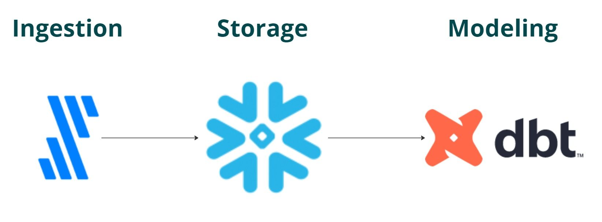

## **Twitche Activity Schema**  
### **Design and Implementation of an Activity Schema for a Streaming Service Using an ELT Data Pipeline**  

This project focuses on designing an **Activity Schema** to track user interactions on a streaming platform. The ELT pipeline extracts, transforms, and loads data efficiently, enabling **product analytics** in **Amplitude**.  

---

## **🚀 Tech Stack**  
| Tool | Purpose |  
|------|---------|  
| **Fivetran** | Extracts data from **Google Sheets** and loads it into Snowflake |  
| **dbt** | Transforms and models the data into an **activity schema** |  
| **Snowflake** | Serves as the **data warehouse** for storage and querying |  
| **Amplitude** | The final destination for analytics and insights |  

---

## **📌 Project Overview**  

This project follows **best practices in data modeling** to structure events and user behaviors for meaningful insights.  

### **1️⃣ Data Extraction (Fivetran 🛠️)**  
- Pulls raw data from **Google Sheets** (simulating event data)  
- Loads it into **Snowflake** for processing  

### **2️⃣ Data Transformation (dbt 📊)**  
- Converts raw event data into **structured, meaningful tables**  
- Implements **an activity schema** suitable for **growth analytics**  
- Ensures **clean, well-defined data models**  

### **3️⃣ Storage & Processing (Snowflake ❄️)**  
- Stores event data in a **scalable, efficient warehouse**  
- Allows complex analytical queries  

### **4️⃣ Product Analytics (Amplitude 📈)**  
- **Final destination for event tracking**  
- Enables deep insights into **user behavior, engagement, and retention**  

---

## **📁 Project Structure**  
```
/user_streams
│── /models  
│   ├── staging/                 # Staging models  
│   ├── marts/                   # Finalized models  
│   ├── seeds/                   # Static datasets  
│── /snapshots                    # Snapshot models  
│── /tests                        # Data quality checks  
│── dbt_project.yml                # Configuration file  
│── README.md                      # Project documentation  
```

---

## **🎯 Key Features**  
✔ **Structured user events into an activity schema**  
✔ **Scalable and efficient data processing** with dbt & Snowflake  
✔ **Optimized event tracking** for product analytics  
✔ **Clean, modular dbt models** for easy maintenance  
✔ **Integration with Amplitude** for insights and dashboards  

---

## **📸 Cover Image**  
  

---

## **📖 How to Use**  

### **🔹 1. Clone the Repository**
```bash
git clone https://github.com/Mo3azAqeed/Twitche-Activity-Schema.git
cd Twitche-Activity-Schema
```

### **🔹 2. Setup the Environment**  
Ensure you have `dbt`, `Snowflake`, and `Fivetran` configured correctly.  

### **🔹 3. Run dbt Models**  
```bash
dbt run
```
For testing:  
```bash
dbt test
```

### **🔹 4. Send Data to Amplitude**  
Once the dbt models are built, data can be sent to Amplitude for analysis.  

---

## **📬 Contact & Contributions**  
💡 Have suggestions or improvements? Feel free to **fork the repo** and submit a **pull request**!  
